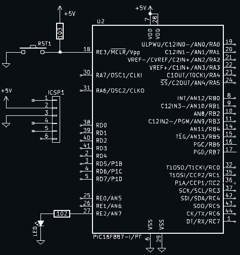

# MCU24 pablinza@me.com
Laboratorio de Microcontroladores

Carpeta con los ejercicios practicos de Laboratorio. Archivos generados en MPLABX utilizando el compilador XC8 y los siguientes modelos:
- Proyectos de practica MPLABX-IDE  mcu20/p887labxx.X
- Archivos de esquema y simulacion  mcu20/circuit
  
Los archivos con extension .c corresponden al codigo fuente de un programa o practica
Los archivos con extension .h y .c con mismo nombre, son procedimientos y funciones basicas
Los archivos con extension .hex representan el codigo de maquina generado para el PIC
Los archivos con extension .png corresponden a una imagen de esquema de circuito

Las practicas estan ordenadas de acuerdo a su nombre de archivo y solo se require cambiar el programa principal .c en el proyecto para la compilacion.

Deben contar con el IDE MPLABX v6.5.x y su compilador XC8 v2.4.x instalados en el ordenador, El circuito base para todos los laboratorios se muestra en el siguiente esquema.

  </img>

El programa base que permite destellar el diodo LED conectado al pin RE2, se deescribe en las siguientes secciones:
#include <xc.h>
  #pragma config FOSC = INTRC_NOCLKO, WDTE = OFF, LVP = OFF
  #define LEDpin PORTEbits.RE2 //Salida LEDpin
  volatile uint8_t tick1ms; 
  void taskLED(void); //Prototipo del procedimiento para destellar LED
  void __interrupt() isr() //Rutina ISR
  {
    if(INTCONbits.T0IF) //Activa cada 1ms
     {
        INTCONbits.T0IF = 0;  //Limpia bandera
        TMR0 += 131; //Reinicia contador 
        tick1ms = 1; //Activa bandera 1ms
    }
  }
  void main(void) 
  {
    OSCCONbits.IRCF = 0b111; //Internal Fosc=8MHz Tcy=0.5u
    while(OSCCONbits.HTS == 0) {}; 
    ANSEL = 0; //Desactiva AN0-AN7
    ANSELH = 0; //Desactiva AN8-AN13
    TRISEbits.TRISE2 = 0; //Salida LED
    OPTION_REGbits.nRBPU = 0; //Activa pull-ups PORTB
    // CONFIGURACION TIMER0 1MS //
    OPTION_REGbits.T0CS = 0;//Modo Termporizador
    OPTION_REGbits.PSA = 0; //Con prescala
    OPTION_REGbits.PS = 0b011; //Prescala 1:16
    TMR0 = 131; ////256-(time/((pre)*(4/Fosc))) time=0.001 seg
    //	CONFIGURA ISR	//
    INTCONbits.T0IF = 0;
    INTCONbits.T0IE = 1;
    INTCONbits.GIE = 1;
    while(1)
    {
        if(tick1ms)
        {
            tick1ms = 0;
            taskLED();
        }
    }
  }
  
  void taskLED(void) //Blink led task
  {
    static uint16_t tcnt = 0;
    if(tcnt++ > 999) 
    {
        tcnt = 0;
        LEDpin = 1;
    }
    if(tcnt == 200) LEDpin = 0;
  }

## Lista de practicas desarrolladas en la Materia
- LAB01 - Control de trafico dos fases con alerta
- LAB02 - Control de temperatura lazo abierto 

Adjunto el siguiente link que muestra como compilar estos ejemplos en MPLABX

Autor: Pablo Zarate Arancibia Ingeniero Electronico pablinzte@gmail.com
Blog de contenido https://pablinza.blogspot.com/
